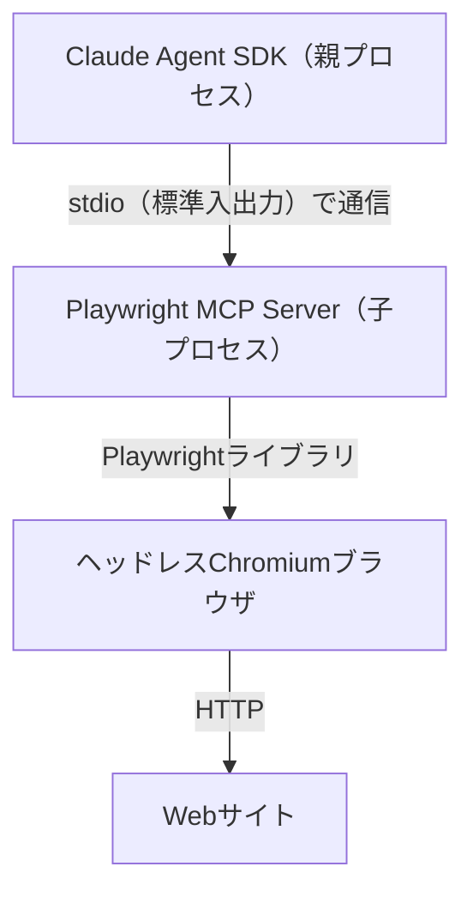

# 04_03_ハンズオンシナリオ案
### 社内Tech News⾃動まとめエージェント（Claude Agent SDK × MCP × A2A）

### 目的
*   実行時にユーザーが指示（プロンプト）して記事作成を依頼する
*   Playwright MCP を使ってWeb記事を読みに⾏き、記事ドラフトを生成する
*   レビューエージェント（A2A）にレビューさせ、改善した最終版を出力する

### 1. 環境構築（Windows + WSL2 Ubuntu22.04 前提）

#### 1.1 管理者権限の取得
WSLをインストールするために管理者権限が必要です。情シスへ申請し、反映まで1日程度見込んでください。
1.  [https://ariseanalytics.atlassian.net/servicedesk/customer/portal/2/group/13/create/31](https://ariseanalytics.atlassian.net/servicedesk/customer/portal/2/group/13/create/31)にアクセス
2.  シンARISE-PC, その他にチェックして備考欄にWSLのインストールと記載

#### 1.2 WSL2 Ubuntu22.04 のインストール
1.  Windows PowerShell を **管理者権限** で開く
2.  以下を実行
    ```bash
    wsl --install -d Ubuntu-22.04
    ```
3.  Ubuntu初回起動時にユーザー名とパスワードを任意の値で設定（忘れないように）
4.  再起動して PowerShell を開き、以下を実行
    ```bash
    wsl -l -v
    ```
5.  `NAME` が `Ubuntu-22.04`、`VERSION` が `2` であることを確認

#### 1.3 DNS の設定（重要）
WSLのデフォルトネットワーク設定が環境依存で特殊になっている場合があり、Docker動作等へ影響します。一般的なLinuxと同等の設定になるよう変更します。
1.  Ubuntu22.04 を開く（アプリ検索 or PowerShellタブの▽から起動）
2.  以下を実行
    ```bash
    sudo vim /etc/wsl.conf
    ```
3.  `i` を押して挿入モードにし、以下を追記
    ```
    [network]
    generateResolvConf=false
    ```
    ※ `false` の `f` は小文字
4.  `ESC` → `:wq` で保存
5.  以下を実行
    ```bash
    sudo rm /etc/resolv.conf
    sudo sh -c "echo 'nameserver 8.8.8.8' > /etc/resolv.conf"
    cat /etc/resolv.conf
    ```
6.  `nameserver 8.8.8.8` になっていることを確認
7.  任意で疎通確認
    ```bash
    curl https://www.google.com
    ```

#### 1.4 Docker のインストール（Ubuntu側に Docker Engine）
1.  一行ずつ実行：
    ```bash
    sudo apt-get update
    sudo apt-get install ca-certificates curl gnupg
    sudo install -m 0755 -d /etc/apt/keyrings
    curl -fsSL https://download.docker.com/linux/ubuntu/gpg | sudo gpg --dearmor -o /etc/apt/keyrings/docker.gpg
    sudo chmod a+r /etc/apt/keyrings/docker.gpg
    ```
2.  まとめて一回で実行：
    ```bash
    echo \
      "deb [arch="$(dpkg --print-architecture)" signed-by=/etc/apt/keyrings/docker.gpg] https://download.docker.com/linux/ubuntu \
      "$(. /etc/os-release && echo "$VERSION_CODENAME")" stable" | \
      sudo tee /etc/apt/sources.list.d/docker.list > /dev/null
    ```
3.  一行ずつ実行：
    ```bash
    sudo apt-get update
    sudo apt-get install docker-ce docker-ce-cli containerd.io docker-compose-plugin
    sudo systemctl start docker
    ```
4.  `Hello from Docker` のような表示が出たら完了
    ```bash
    sudo docker run hello-world
    ```

#### 1.5 Docker グループ設定
1.  一行ずつ実行：
    ```bash
    sudo groupadd docker
    sudo usermod -aG docker $USER
    ```
2.  Ubuntu を再起動（権限変更反映のため）
3.  以下を実行して確認：
    ```bash
    docker run hello-world
    ```

### 2. ハンズオン：記事作成エージェント（自由プロンプト入力）
※各自dockerコンテナを用意するなどしてPC環境を破壊しないように注意してください

#### 2.1 前提（WSL2 / Linux 共通）
*   Docker Engine（WSL上）と docker compose が使えること
*   以降の作業は WSL上のディレクトリで行うこと（Windows側ではなくUbuntu側）

#### 2.2 プロジェクト作成（ホスト側：WSL）

##### 2.2.1 作業ディレクトリ作成
Ubuntu（WSL）で以下を実行：
```bash
mkdir -p agent-handson && cd agent-handson
```

##### 2.2.2 `.env` を作る（APIキーはここに置く）
`agent-handson/.env` を作成し、以下のどちらか（または両方）を設定します。

A) Anthropic API を使う場合  

以下を実行して`.env`を作成
```bash
cp .env.sample .env
```

```
ANTHROPIC_API_KEY=sk-ant-xxxxxxxxxxxxxxxx

# モデル指定（共通）
# 例. ANTHROPIC_MODEL
# 例. ANTHROPIC_MODEL=claude-3-5-sonnet-latest
ANTHROPIC_MODEL=xxx
```

B) Amazon Bedrock（API Key / Bearer token）を使う場合
```
# Bedrock経由で動かすフラグ（Claude Code/Agent SDK側が参照）
CLAUDE_CODE_USE_BEDROCK=1

# Bedrockのリージョン（例）
AWS_REGION=ap-northeast-1

# Bedrock API key（Bearer token）
AWS_BEARER_TOKEN_BEDROCK=xxxxxxxxxxxxxxxx

# モデル指定（共通）
# 例. ANTHROPIC_MODEL=apac.anthropic.claude-sonnet-4-20250514-v1:0
ANTHROPIC_MODEL=xxxx
```
`.env` は機密情報です。Gitにコミットしないよう `.gitignore` を設定します（後述）。

##### 2.2.3 ファイル構成
この構成でファイルを作ります：
```
agent-handson/
  .env
  .gitignore       (任意)
  Dockerfile
  requirements.txt
  review_agent.py
  main.py
  tools_action_manager.py
  output/          (生成物)
```

#### 2.3 Dockerイメージを作る（Dockerfile）

##### 2.3.1 requirements.txt
`agent-handson/requirements.txt`
```
claude-agent-sdk
a2a-sdk[http-server]
httpx
python-dotenv
uvicorn
```

##### 2.3.2 Dockerfile
Playwright MCP を `npx` で起動するため Node.js が必要です。Docker の場合は Playwright 公式イメージに Node.js が含まれるため追加インストールは不要です。ホスト（Cursor 等）で Playwright MCP を使う場合は、あらかじめ Node.js をインストールしてください。
また、Web閲覧を安定させるために Playwright公式イメージをベースにします（ブラウザ依存が揃っているため）。
`agent-handson/Dockerfile`
```dockerfile
# Playwright公式イメージ（ブラウザ実行に必要な依存が揃っている）
FROM mcr.microsoft.com/playwright:v1.58.2-jammy

ENV DEBIAN_FRONTEND=noninteractive
WORKDIR /app

# Python環境（Ubuntu 22.04ベースなのでpython3はあるが、pip等を確実にする）
RUN apt-get update && apt-get install -y --no-install-recommends \
    python3 python3-pip \
    && rm -rf /var/lib/apt/lists/*

# 依存関係
COPY requirements.txt /app/requirements.txt
RUN python3 -m pip install --upgrade pip && \
    python3 -m pip install -r /app/requirements.txt

# アプリ本体はマウント運用でも良いが、ここでは一応COPYも可能にしておく
COPY . /app

# デフォルトはシェル（必要なら main.py にしてもOK）
CMD ["bash"]
```

#### 2.4 実装（Pythonファイルを作成）

##### 2.4.1 レビューエージェント（A2Aサーバ） review_agent.py
`agent-handson/review_agent.py`
```python
import os
import re
import uvicorn
from a2a.server.apps import A2AStarletteApplication
from a2a.server.request_handlers import DefaultRequestHandler
from a2a.server.tasks import InMemoryTaskStore
from a2a.server.agent_execution import AgentExecutor, RequestContext
from a2a.server.events import EventQueue
from a2a.client import create_text_message_object
from a2a.types import AgentCapabilities, AgentCard, AgentSkill, Role

REQUIRED_SECTIONS = ["要約", "重要ポイント", "参考リンク", "次アクション"]

def simple_review(text: str) -> str:
    findings = []
    for sec in REQUIRED_SECTIONS:
        if sec not in text:
            findings.append(f"- セクション不足: 「{sec}」を追加すると読みやすい")
    if len(text) < 600:
        findings.append("- 文字数が短め：背景/結論/根拠をもう少し足すと社内共有に強い")
    if not re.search(r"https?://", text):
        findings.append("- 参考リンクが見当たりません：一次ソースURLを最低1つ入れるのがおすすめ")
    if not findings:
        findings.append("- 大きな不足は見当たりません。タイトルと結論が明確で良いです。")
    return "A2Aレビュー結果（自動）:\n" + "\n".join(findings)

class ReviewExecutor(AgentExecutor):
    async def execute(self, context: RequestContext, event_queue: EventQueue) -> None:
        user_text = context.get_user_input() or "(テキスト取得に失敗しました)"
        review_msg = create_text_message_object(role=Role.agent, content=simple_review(user_text))
        await event_queue.enqueue_event(review_msg)

    async def cancel(self, context: RequestContext, event_queue: EventQueue) -> None:
        raise Exception("cancel not supported")

def build_agent_card(base_url: str) -> AgentCard:
    skill = AgentSkill(
        id="review_draft",
        name="レビュー（Confluenceドラフト）",
        description="Confluence向けドラフトの不足セクションと改善点をチェックします。",
        tags=["review", "checklist", "confluence"],
        examples=["このドラフトをレビューして", "不足セクションを指摘して"],
    )
    return AgentCard(
        name="レビューエージェント",
        description="ドラフトをレビューしてチェックリストを返すA2Aエージェント。",
        url=base_url,
        version="1.0.0",
        default_input_modes=["text"],
        default_output_modes=["text"],
        capabilities=AgentCapabilities(streaming=False),
        skills=[skill],
    )

def _cli():
    host = "0.0.0.0"
    port = 9999
    base_url = os.environ.get("A2A_CARD_URL", f"http://localhost:{port}/")

    agent_card = build_agent_card(base_url)
    request_handler = DefaultRequestHandler(
        agent_executor=ReviewExecutor(),
        task_store=InMemoryTaskStore(),
    )
    server = A2AStarletteApplication(agent_card=agent_card, http_handler=request_handler)
    uvicorn.run(server.build(), host=host, port=port)

if __name__ == "__main__":
    _cli()
```

##### 2.4.2 A2Aクライアント & 保存 tools_action_manager.py
`agent-handson/tools_action_manager.py`
```python
from __future__ import annotations

import os
from pathlib import Path
from uuid import uuid4

import httpx
from a2a.client import A2AClient, A2ACardResolver, create_text_message_object
from a2a.types import MessageSendParams, SendMessageRequest, Message


def save_markdown(path: str, content: str) -> str:
    Path("output").mkdir(parents=True, exist_ok=True)
    p = Path(path)
    p.write_text(content, encoding="utf-8")
    return f"Saved: {p.resolve()}"


async def a2a_review(draft_text: str, a2a_base_url: str | None = None) -> str:
    if a2a_base_url is None:
        a2a_base_url = os.environ.get("A2A_BASE_URL", "http://localhost:9999")

    async with httpx.AsyncClient() as httpx_client:
        resolver = A2ACardResolver(httpx_client=httpx_client, base_url=a2a_base_url)
        agent_card = await resolver.get_agent_card()
        client = A2AClient(httpx_client=httpx_client, agent_card=agent_card)

        message = create_text_message_object(content=draft_text)
        req = SendMessageRequest(
            id=str(uuid4()),
            params=MessageSendParams(message=message),
        )
        resp = await client.send_message(req)
        dumped = resp.model_dump(mode="json", exclude_none=True)

        texts = []
        try:
            result = dumped.get("result", {})
            parts = result.get("parts") or result.get("status", {}).get("message", {}).get("parts", [])
            for p in parts:
                if p.get("kind") == "text" and "text" in p:
                    texts.append(p["text"])
        except Exception:
            pass

        return "\n".join(texts) if texts else str(dumped)
```

##### 2.4.3 記事作成エージェント（URL＋自由プロンプト入力CLI） main.py
`agent-handson/main.py`
```python
from __future__ import annotations

import asyncio
from datetime import datetime

from claude_agent_sdk import query, ClaudeAgentOptions
from claude_agent_sdk.types import AssistantMessage, ResultMessage, TextBlock
from tools_action_manager import save_markdown, a2a_review

DEFAULT_URL = "https://zenn.dev/tmtk/articles/624b98c6a52f09"

BASE_INSTRUCTION = """
あなたは社内向けの「記事作成エージェント」です。
目的：指定URLを読み、Confluence貼り付け用のMarkdown記事を作成する。

必須要件：
- 見出しと箇条書きを多用して読みやすく
- 最低でも次のセクションを含める：
  - 要約
  - 重要ポイント
  - 参考リンク（参照元URLを必ず含める）
  - 次アクション（社内での活用・検討観点）
- 出力は日本語
- Web閲覧は Playwright MCP を使う（必要最低限のアクセス回数で）
"""

REVISION_INSTRUCTION = """
あなたは社内向け記事の編集者です。
与えられた「ドラフト」と「レビュー結果」をもとに、Confluence貼り付け用Markdownとして改善した最終版を出力してください。

必須要件：
- 「レビュー結果」で指摘された不足セクションや改善点を反映
- 文章量が極端に増えないように、重要なところだけ改善
- 参考リンクは維持し、必要なら増やす（一次ソース優先）
"""

def read_multiline(prompt: str) -> str:
    print(prompt)
    print("（入力終了は空行を1行入力）")
    lines = []
    while True:
        line = input()
        if line.strip() == "":
            break
        lines.append(line)
    return "\n".join(lines).strip()

async def run_agent(prompt: str, options: ClaudeAgentOptions) -> str:
    result_text = ""
    async for msg in query(prompt=prompt, options=options):
        if isinstance(msg, AssistantMessage):
            text_parts = [b.text for b in msg.content if isinstance(b, TextBlock)]
            if text_parts:
                result_text = "\n".join(text_parts)
                print(result_text[:200], "..." if len(result_text) > 200 else "")
        elif isinstance(msg, ResultMessage):
            if msg.result:
                result_text = msg.result
    return result_text

async def main():
    # Playwright MCP（外部MCP：stdio）
    # --no-sandbox：Dockerコンテナ内ではカーネルのサンドボックス制限があるため必須
    options = ClaudeAgentOptions(
        mcp_servers={
            "playwright": {
                "type": "stdio",
                "command": "npx",
                "args": ["-y", "@playwright/mcp@latest", "--headless", "--no-sandbox"],
            }
        },
        allowed_tools=[
            "mcp__playwright__*",
            "Read", "Write", "Edit", "Bash",
        ],
    )

    print("=== 記事作成エージェント（自由プロンプト入力）===")
    print("終了する場合は Ctrl+C またはプロセス終了してください。\n")

    while True:
        url = input(f"対象URL（未入力ならデフォルト: {DEFAULT_URL}）> ").strip()
        if not url:
            url = DEFAULT_URL

        user_prompt = read_multiline("自由プロンプト（例：経営層向け/技術者向け/短め/用語に注釈 等）>")

        now = datetime.now().strftime("%Y%m%d_%H%M%S")
        draft_path = f"output/draft_{now}.md"
        final_path = f"output/final_{now}.md"

        # 1) ドラフト生成（Playwright MCP を使って読む）
        draft_prompt = f"""{BASE_INSTRUCTION}

対象URL: {url}

ユーザー要望（自由プロンプト）:
{user_prompt if user_prompt else "(指定なし)"}

出力は「完成したMarkdown本文のみ」を返してください。
"""
        print("\n--- ドラフト生成を開始 ---\n")
        draft_text = await run_agent(draft_prompt, options)
        save_markdown(draft_path, draft_text)

        # 2) A2Aでレビュー
        print("\n--- A2Aレビューを開始 ---\n")
        review_text = await a2a_review(draft_text)

        # 3) レビュー反映して最終版生成
        revise_prompt = f"""{REVISION_INSTRUCTION}

対象URL: {url}

ドラフト:
{draft_text}

レビュー結果:
{review_text}

出力は「完成したMarkdown本文のみ」を返してください。
"""
        print("\n--- 最終版生成を開始 ---\n")
        final_text = await run_agent(revise_prompt, options)
        save_markdown(final_path, final_text)

        print("\n=== 完了 ===")
        print(f"- Draft : {draft_path}")
        print(f"- Final : {final_path}\n")

def _cli():
    asyncio.run(main())

if __name__ == "__main__":
    _cli()
```

### **2.5 Dockerイメージのビルド（WSLターミナル）**

`agent-handson` ディレクトリで：

```markdown
docker build -t agent-handson:latest .
```

### **2.6 実⾏（コンテナで2プロセス動かす）**

#### 2.6.1 ターミナル1：レビューエージェント起動（コンテナ）

```markdown
docker run --rm -it \
  --env-file ./.env \
  -p 9999:9999 \
  -v "$PWD:/app" \
  -w /app \
  agent-handson:latest \
  python3 review_agent.py
```

確認（任意、別ターミナルで）：

```markdown
curl http://localhost:9999/.well-known/agent-card.json
```

#### 2.6.2 ターミナル2：記事作成エージェント起動（コンテナ）

```markdown
docker run --rm -it \
  --env-file ./.env \
  --network host \
  -v "$PWD:/app" \
  -w /app \
  agent-handson:latest \
  python3 main.py
```

⽣成物：
`output/draft_YYYYMMDD_HHMMSS.md`
`output/final_YYYYMMDD_HHMMSS.md`
※ `-v "$PWD:/app"` でホストのフォルダをマウントしているため、⽣成物はホスト側 `agent-handson/output/` に残ります。

### **3. 解説**

#### **3.1 全体アーキテクチャ**

このシステムは⼤きく5つの要素で構成

1.  **記事作成エージェント `main.py`**
    URLと自由プロンプトを受け取り、LLMと対話してドラフト→最終版を生成
2.  **レビューエージェント `review_agent.py`**
    A2Aサーバとして動作し、ドラフトをチェックして改善点を返す
3.  **Claude Agent SDK** (`claude-agent-sdk`) (ライブラリ)
    LLMとの対話・ツール呼び出し・MCPサーバ管理を担う中核
4.  **Playwright MCP** (`@playwright/mcp`) (npmパッケージ)
    ヘッドレスブラウザでWebページを閲覧する
5.  **A2Aクライアント** (`tools_action_manager.py`)
    レビューエージェントにHTTPでドラフトを送信

#### **3.2 処理フロー（シーケンス図）**

##### Phase 1：ドラフト⽣成

1.  ユーザーがCLIから対象URLと自由プロンプトを入力
2.  `main.py` が Claude Agent SDK の `query` 関数を呼び出し、LLMと対話を開始
3.  LLM が Playwright MCP 経由で指定URLのWebページにアクセスし、記事の内容を取得
4.  取得した情報をもとに、Markdown形式のドラフトを生成し、 `output/draft_*.md` として保存

##### Phase 2：A2Aレビュー

5.  ⽣成されたドラフトを A2Aクライアント が HTTP POST で レビューエージェント（Port 9999）に送信
6.  レビューエージェントは必須セクションの有無・⽂字数・参考リンクの有無をチェックし、改善点をテキストで返す

##### Phase 3：最終版⽣成

7.  ドラフトとレビュー結果を合わせて再度 Claude Agent SDK 経由でLLMに投げ、改善版を⽣成
8.  最終版を `output/final_*.md` として保存

#### **3.3 各技術の役割と該当コード**

##### **3.3.1 Claude Agent SDK ̶ エージェントの「頭脳」**

Claude Agent SDK は、このシステム全体の中核
LLM（Claude）との対話、ツールの管理、MCPサーバの起動をすべてこのSDKが担う

##### ① LLMとの対話（query関数）

`main.py` の以下の部分で、Claude Agent SDK の `query` 関数を使ってLLMとやり取り

```python
# main.py
from claude_agent_sdk import query, ClaudeAgentOptions
from claude_agent_sdk.types import AssistantMessage, ResultMessage, TextBlock

async def run_agent(prompt: str, options: ClaudeAgentOptions) -> str:
    result_text = ""
    async for msg in query(prompt=prompt, options=options):
        if isinstance(msg, AssistantMessage):
            text_parts = [b.text for b in msg.content if isinstance(b, TextBlock)]
            if text_parts:
                result_text = "\n".join(text_parts)
                print(result_text[:200], "..." if len(result_text) > 200 else "")
        elif isinstance(msg, ResultMessage):
            if msg.result:
                result_text = msg.result
    return result_text
```

ポイントは `async for msg in query(...)` の部分。`query` はジェネレータとして動作し、LLMからの応答を1メッセージずつ受け取る。`AssistantMessage` の中間応答を逐次表示しながら、最終的な `ResultMessage` でまとめた結果を取得する。

##### ② MCPサーバの管理

`ClaudeAgentOptions` の `mcp_servers` パラメータで、どのMCPサーバを使うかを宣⾔的に指定。

```python
# main.py
options = ClaudeAgentOptions(
    mcp_servers={
        "playwright": {                   # ← MCPサーバ名
            "type": "stdio",              # ← 通信方式（標準入出力）
            "command": "npx",
            "args": ["-y", "@playwright/mcp@latest", "--headless", "--no-sandbox"],
        }
    },
    ...
)
```

`mcp_servers` に設定を書くだけで、SDK が⾃動的に Playwright MCP サーバをサブプロセスとして起動し、stdio （標準⼊出⼒）経由で通信可能に。開発者はブラウザの起動・管理を⼀切意識する必要なし。

##### ③ ツール権限制御（allowed_tools）

`allowed_tools` でLLMが使えるツールを明⽰的に制限。 `"mcp__playwright__*"` のようにワイルドカード指定することで、Playwright MCPが提供するすべてのツール（ページ遷移、テキスト取得、スクリーンショットなど）をまとめて許可。

##### **3.3.2 MCP（Model Context Protocol） ̶ ツール連携の「標準規格」**

MCP は、LLMが外部ツール（ブラウザ、ファイルシステム、データベースなど）と連携するための標準プロトコル。このハンズオンでは Playwright MCP を使って、LLMにWebブラウザ操作の能⼒を与えている。

##### MCPの動作の仕組み

MCPの通信は以下のように動作。
具体的には、SDK の `mcp_servers` 設定に基づいて以下が⾃動で実⾏。

1.  **サーバ起動**: `npx @playwright/mcp@latest --headless --no-sandbox` が子プロセスとして起動される
2.  **ツール発見**: MCP の `tools/list` メッセージにより、利用可能なツール一覧が自動取得される (`mcp__playwright__browser_navigate`, `mcp__playwright__browser_snapshot` など)
3.  **ツール呼び出し**: LLMが「このURLを読みたい」と判断すると、SDK が MCP の `tools/call` メッセージを送り、Playwright がブラウザを操作してページ内容を返す

```python
# main.py
options = ClaudeAgentOptions(
    mcp_servers={
        "playwright": {
            "type": "stdio",
            "command": "npx",
            "args": ["-y", "@playwright/mcp@latest", "--headless", "--no-sandbox"],
            #                                                        ^^^^^^^^^^
            #  Dockerコンテナ内ではカーネルのサンドボックス制限があるため必須
        }
    },
    allowed_tools=[
        "mcp__playwright__*",  # ← Playwright MCPの全ツールを許可
        "Read",                # ← ファイル読み込み
        "Write",               # ← ファイル書き込み
        "Edit",                # ← ファイル編集
        "Bash",                # ← シェルコマンド実行
    ],
)
```



##### **3.3.3 A2A（Agent-to-Agent Protocol） ̶ エージェント間の「共通⾔語」**

A2A は、Google が提唱するエージェント間通信のオープンプロトコル。異なるフレームワークで作られたエージェント同⼠が、HTTP経由で協調作業できるようになる。

このハンズオンでは「レビューエージェント」を A2A サーバとして独⽴プロセスで動かし、記事作成エージェントから呼び出している。

##### ① A2Aサーバ側（review_agent.py）

A2Aサーバは3つの要素で構成されます。

**(a) エージェントカード ̶ ⾃分の能⼒を宣⾔するメタデータ**

エージェントカードは `http://localhost:9999/.well-known/agent-card.json` で公開され、クライアントはこれを読んで「このエージェントが何をできるか」を事前に知ることができる。

```python
# review_agent.py（48-65⾏⽬）
def build_agent_card(base_url: str) -> AgentCard:
    skill = AgentSkill(
        id="review_draft",
        name="レビュー（Confluenceドラフト）",
        description="Confluence向けドラフトの不⾜セクションと改善点をチェックします。",
        tags=["review", "checklist", "confluence"],
        examples=["このドラフトをレビューして", "不⾜セクションを指摘して"],
    )
    return AgentCard(
        name="レビューエージェント",
        description="ドラフトをレビューしてチェックリストを返すA2Aエージェント。",
        url=base_url,
        version="1.0.0",
        default_input_modes=["text"],
        default_output_modes=["text"],
        capabilities=AgentCapabilities(streaming=False),
        skills=[skill],
    )
```

**(b) タスク実⾏ロジック ̶ 実際のレビュー処理**

今回はシンプルなルールベースのレビューだが、ここを別のLLMベースのエージェントに置き換えることも可能。ぜひ記事作成エージェントを参考にやってみてください。

```python
# review_agent.py（14-25⾏⽬）
REQUIRED_SECTIONS = ["要約", "重要ポイント", "参考リンク", "次アクション"]

def simple_review(text: str) -> str:
    findings = []
    for sec in REQUIRED_SECTIONS:
        if sec not in text:
            findings.append(f"- セクション不⾜: 「{sec}」を追加すると読みやすい")
    if len(text) < 600:
        findings.append("- ⽂字数が短め：背景/結論/根拠をもう少し⾜すと社内共有に強い")
    if not re.search(r"https?://", text):
        findings.append("- 参考リンクが⾒当たりません：⼀次ソースURLを最低1つ⼊れるのがお")
    if not findings:
        findings.append("- ⼤きな不⾜は⾒当たりません。タイトルと結論が明確で良いです。")
    return "A2Aレビュー結果（⾃動）:\n" + "\n".join(findings)
```

**(c) サーバ起動 ̶ UvicornでHTTPサーバとして起動**

```python
# review_agent.py
def _cli():
    host = "0.0.0.0"
    port = 9999
    base_url = os.environ.get("A2A_CARD_URL", f"http://localhost:{port}/")

    agent_card = build_agent_card(base_url)
    request_handler = DefaultRequestHandler(
        agent_executor=ReviewExecutor(),
        task_store=InMemoryTaskStore(),
    )
    server = A2AStarletteApplication(agent_card=agent_card, http_handler=request_handler)
    uvicorn.run(server.build(), host=host, port=port)

if __name__ == "__main__":
    _cli()
```

##### ② A2Aクライアント側（tools_action_manager.py）

クライアント側は以下の⼿順でレビューを依頼

A2A通信のポイントは以下の3ステップです。

1.  **カード取得**： `/.well-known/agent-card.json` からエージェントの能⼒を確認
2.  **メッセージ送信**： `SendMessageRequest` でドラフトテキストを送る
3.  **結果受信**：レスポンスの `parts` からテキストを抽出

```python
# tools_action_manager.py
async def a2a_review(draft_text: str, a2a_base_url: str | None = None) -> str:
    if a2a_base_url is None:
        a2a_base_url = os.environ.get("A2A_BASE_URL", "http://localhost:9999")

    async with httpx.AsyncClient() as httpx_client:
        # 1. エージェントカードを取得（能力確認）
        resolver = A2ACardResolver(httpx_client=httpx_client, base_url=a2a_base_url)
        agent_card = await resolver.get_agent_card()

        # 2. A2Aクライアントを初期化
        client = A2AClient(httpx_client=httpx_client, agent_card=agent_card)

        # 3. メッセージを組み立てて送信（create_text_message_object でラップ）
        message = create_text_message_object(content=draft_text)
        req = SendMessageRequest(
            id=str(uuid4()),
            params=MessageSendParams(message=message),
        )
        resp = await client.send_message(req)

        # 4. レスポンスからテキストを抽出
        dumped = resp.model_dump(mode="json", exclude_none=True)
        # ... テキスト抽出処理 ...
```