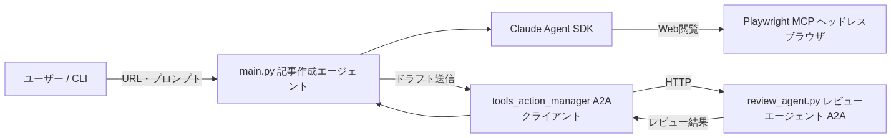
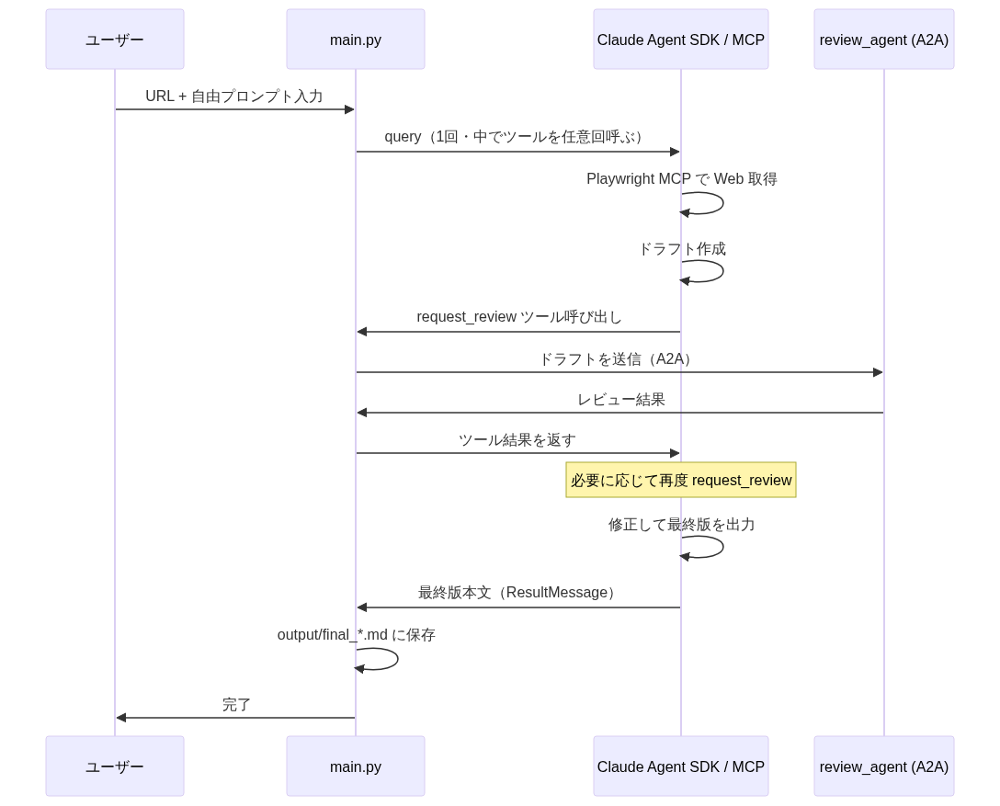

# 自律型エージェント入門 — Claude Agent × MCP × A2A で作る記事自動作成

指定URLのWeb記事を読み、社内向けMarkdownにまとめるデモです。**記事作成エージェント**が**レビューエージェント**に A2A で何度でもレビューを依頼し、指摘を反映してから最終版を出す「マルチエージェント」の動きを、**Claude Agent SDK**・**MCP（Playwright）**・**A2A** で実装しています。レビューを何回行うかはコードで決めず、エージェントの判断に任せています。

---

## 1. 前提条件

このコードを実行するために、以下が満たされている必要があります。

- **Docker** が利用できること（Docker Engine および `docker` コマンド）
- **Anthropic API キー** または **Amazon Bedrock** の認証情報が用意できること
- （推奨）Linux または WSL2 上で実行。Windows/macOS の Docker では `--network host` の挙動が異なるため、その場合は後述の [Troubleshooting](#4-troubleshooting) を参照してください。

※ Docker のインストール方法は [Docker 公式ドキュメント](https://docs.docker.com/get-docker/) を参照してください。

---

## 2. クイックスタート（clone して動かす）

このリポジトリを clone し、環境変数を設定してから 2 つのプロセスを起動します。

### 2.1 リポジトリの取得

```bash
git clone https://github.com/takuya-tokumoto/agent-handson.git
cd agent-handson
```

### 2.2 環境変数の設定

`.env.sample` をコピーして `.env` を作成し、API キーとモデル名を設定します。

```bash
cp .env.sample .env
```

`.env` を編集し、以下を設定してください。

- **Anthropic API を使う場合**: `ANTHROPIC_API_KEY` と `ANTHROPIC_MODEL`（例: `claude-3-5-sonnet-latest`）
- **Amazon Bedrock を使う場合**: `.env.sample` 内の Bedrock 用のコメントを参考に、必要な変数を有効化してください。

`.env` は機密情報のため、Git にコミットしないでください（`.gitignore` に含まれています）。

### 2.3 Docker イメージのビルド

`agent-handson` ディレクトリで以下を実行します。

```bash
docker build -t agent-handson:latest .
```

ベースイメージには Playwright 公式イメージを使用しており、ブラウザ実行に必要な依存が含まれています。

### 2.4 実行（2 プロセス）

**ターミナル 1** でレビューエージェント（A2A サーバ）を起動します。

```bash
docker run --rm -it \
  --env-file ./.env \
  -p 9999:9999 \
  -v "$PWD:/app" \
  -w /app \
  agent-handson:latest \
  python3 review_agent.py
```

（任意）別ターミナルで `curl http://localhost:9999/.well-known/agent-card.json` を実行し、応答があることを確認できます。

**ターミナル 2** で記事作成エージェントを起動します。

```bash
docker run --rm -it \
  --env-file ./.env \
  --network host \
  -v "$PWD:/app" \
  -w /app \
  agent-handson:latest \
  python3 main.py
```

プロンプトに従って対象URLと自由プロンプトを入力すると、記事作成エージェントが URL を読み、ドラフトを作成し、**レビューエージェントに必要に応じて何度でもレビューを依頼**してから最終版を出力します。生成物は次のファイルに保存されます。

- `output/final_YYYYMMDD_HHMMSS.md` … 最終版（レビューを繰り返したあとの完成記事）

`-v "$PWD:/app"` でホストのカレントディレクトリをマウントしているため、生成物はホスト側の `agent-handson/output/` に残ります。終了する場合は Ctrl+C で終了してください。

---

## 3. 解説

このリポジトリでは、**Claude Agent SDK**・**MCP**・**A2A** の 3 つの技術で、記事作成エージェントとレビューエージェントが**自律的にやり取りする**マルチエージェントを実装しています。全体像と処理の流れを説明します。

### 3.1 使っている技術

| 技術 | 役割 | 主なファイル |
|------|------|--------------|
| **Claude Agent SDK** | LLM（Claude）との対話・ツール呼び出しを担う中核。記事作成もレビューも LLM で動く | `main.py`（記事作成）、`review_agent.py`（レビュー） |
| **MCP（Playwright）** | ヘッドレスブラウザで Web を閲覧。記事作成エージェントが URL の内容を取得するときに利用 | `main.py` で MCP サーバとして起動 |
| **MCP（レビュー依頼）** | 記事作成エージェント用のツール。レビューエージェントにドラフトを送り、フィードバックを得る。**呼び出し回数は LLM が判断** | `main.py`（ツール定義）、`tools_action_manager.py`（A2A 通信） |
| **A2A** | エージェント間の HTTP 通信。レビューエージェントがサーバ、記事作成側のツールがクライアント | サーバ: `review_agent.py` / クライアント: `tools_action_manager.py` |

「記事作成エージェント」は LLM ＋ Playwright MCP（Web 閲覧）＋ レビュー依頼ツール（A2A）を持ち、**コードで回数を決めずに**、必要に応じて何度でもレビューを依頼してから最終版を出します。

### 3.2 全体の構成

1. **記事作成エージェント**（`main.py`）… URL を読み、ドラフトを作り、レビューエージェントに**必要に応じて何度でも**レビューを依頼してから、最終版を出力する。
2. **レビューエージェント**（`review_agent.py`）… A2A サーバとして動作し、送られてきたドラフトを LLM でレビューし、改善点を返す。
3. **Playwright MCP** … Web 閲覧用ツール。記事作成エージェントが URL の内容を取得するときに利用。
4. **レビュー依頼ツール** … 記事作成エージェントが「レビューしてほしい」ときに呼ぶツール。中で A2A を使ってレビューエージェントに送信する。

構成のイメージは以下のとおりです。



### 3.3 処理の流れ

「ドラフト → 1 回だけレビュー → 1 回修正」のような固定の流れはありません。記事作成エージェント（LLM）が**自律的に**次のように動きます。

1. ユーザーが URL と自由プロンプトを入力する。
2. Playwright で URL の内容を取得し、記事ドラフトを作成する。
3. レビューエージェントにドラフトを送り、フィードバックを得る。
4. フィードバックを踏まえて修正する。必要なら 3 に戻り、**再度レビューを依頼する**（回数はエージェントの判断）。
5. 十分な内容になったら完成版を出力する。結果は `output/final_*.md` に保存される。

レビューを何回行うか・いつ「OK」とするかは、**エージェント間のやり取りに任せています**。

処理の流れのイメージは以下のとおりです。



---

## 4. Troubleshooting

- **API キーやモデル関連のエラーが出る**  
  `.env` を `.env.sample` からコピーしたうえで、`ANTHROPIC_API_KEY` と `ANTHROPIC_MODEL` を正しく設定しているか確認してください。

- **レビュー時に「接続できませんでした」や Connection refused が出る**  
  ターミナル 1 で `review_agent.py` が起動しているか確認してください。先にレビューエージェントを起動してから、ターミナル 2 で `main.py` を実行します。

- **最終版が得られない / 極端に短い**  
  対象 URL が正しいか、Playwright MCP が正常に動作しているか、レビューエージェントが起動しているかを確認してください。最終版が空または 50 文字未満の場合は **ValueError が発生してプロセスが異常終了**します。

- **Windows や macOS で Docker の `--network host` が使えない場合**  
  Linux 以外では `--network host` の挙動が異なります。記事作成エージェント用のコンテナからレビューエージェントへ接続するには、`A2A_BASE_URL=http://host.docker.internal:9999` を環境変数で渡すか、`.env` に追記してから `docker run` で `--env-file .env` を指定してください。

---

## リポジトリ

- https://github.com/takuya-tokumoto/agent-handson
